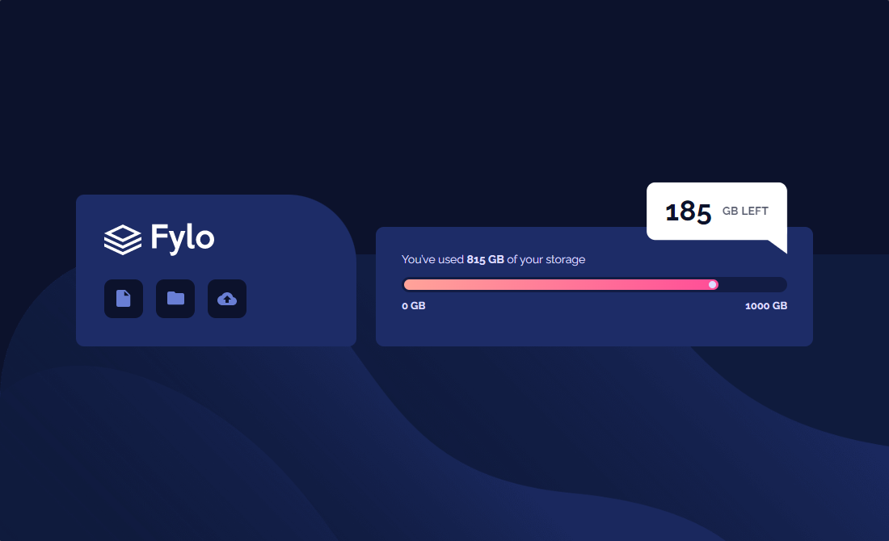
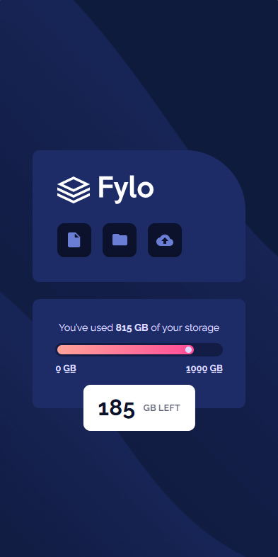
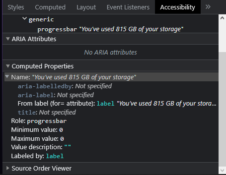
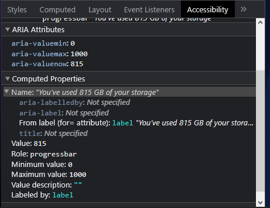

<div id="top"></div>
<div align="center">

<a href="https://www.frontendmentor.io/profile/CosmoArt"></a>
<a href="https://www.instagram.com/cosmo_art0/"></a>
<a href="https://cosmoart.github.io"></a>
<a href="https://www.discord.com/users/734087835472232559/"></a>
<a href="https://twitter.com/CosmoArt0"></a>

# Frontend Mentor - Fylo data storage component solution

This is a solution to the [Fylo data storage component challenge on Frontend Mentor](https://www.frontendmentor.io/challenges/fylo-data-storage-component-1dZPRbV5n). Frontend Mentor challenges help you improve your coding skills by building realistic projects.

[Solution][solution-url] . [Live Page][live-page]

</div>

<details>
<summary>Table of contents</summary>

-   [Overview](#overview)
    -   [The challenge](#the-challenge)
    -   [Screenshots](#screenshots)
    -   [Links](#links)
-   [My process](#my-process)
    -   [Built with](#built-with)
    -   [What I learned](#what-i-learned)
    -   [Useful resources](#useful-resources)
-   [Author](#author)

</details>

## Overview

### The challenge

Users should be able to:

-   View the optimal layout for the site depending on their device's screen size

### Screenshots

<table>
        <tr>
            <td>
                
            </td>
            <td>
                
            </td>
        </tr>
</table>

### Links

-   [Solution][solution-url]
-   [Live Page][live-page]

## My process

### Built with

-   Semantic HTML5 markup
-   CSS custom properties
-   Flexbox
-   Mobile-first workflow

<p align="right">(<a href="#top">back to top</a>)</p>

### What I learned

It was an interesting challenge because it had to use the &lt;progress> element, which had two main problems:

#### 1. Styling the progress bar

It was my first time styling a &lt;progress> element, so the [css trick blog](https://css-tricks.com/html5-progress-element/) where this is discussed was very helpful.

This is the final css used for the progress bar:

```css
progress {
    -webkit-appearance: none;
    appearance: none;
    width: 100%;
    position: relative;
    height: 19px;
}
progress::-webkit-progress-bar {
    border-radius: 1rem;
    background-color: hsla(229, 57%, 11%, 0.603);
}
progress::-webkit-progress-value {
    border-radius: 1rem;
    display: inline-block;
    height: 13px;
    vertical-align: middle;
    background-image: var(--Gradient);
    margin: 3px;
}
progress::after {
    content: "";
    width: 9px;
    height: 9px;
    position: absolute;
    top: 5px;
    right: 18.5%;
    border-radius: 50%;
    background-color: var(--PaleBlue);
}
```

#### 2. The accessibility


Looking at the accessibility tab of the devtools I noticed that the maximum and minimum values were 0 and that the "value" was missing, so I decided to investigate and I found some aria attributes that solve this problem: the [aria-valuemin](https://developer.mozilla.org/en-US/docs/Web/Accessibility/ARIA/Attributes/aria-valuemin), the [aria-valuemax](https://developer.mozilla.org/en-US/docs/Web/Accessibility/ARIA/Attributes/aria-valuemax), and the [aria-valuenow](https://developer.mozilla.org/en-US/docs/Web/Accessibility/ARIA/Attributes/aria-valuenow).

&lt;progress> element before the aria attributes:

```html
<progress id="progress" max="1000" value="815"></progress>
```



&lt;progress> element after the aria attributes:

```html
<progress id="progress" max="1000" value="815" aria-valuemin="0" aria-valuemax="1000" aria-valuenow="815"></progress>
```



<p align="right">(<a href="#top">back to top</a>)</p>

<hr>

### Useful resources

- [CSS trick blog](https://css-tricks.com/html5-progress-element/) - This css tricks blog helped me to style the progress bar

<p align="right">(<a href="#top">back to top</a>)</p>

## Author
- Instagram - [@cosmo_art0](https://www.instagram.com/cosmo_art0/)
- Frontend Mentor - [@CosmoArt](https://www.frontendmentor.io/profile/cosmoart)
- Twitter - [@CosmoArt0](https://twitter.com/cosmoart0)
- My personal page - [https://cosmoart.github.io](https://cosmoart.github.io)

<p align="right">(<a href="#top">back to top</a>)</p>

[live-page]: https://img.shields.io/github/contributors/othneildrew/Best-README-Template.svg?style=for-the-badge
[solution-url]: https://github.com/othneildrew/Best-README-Template/graphs/contributors